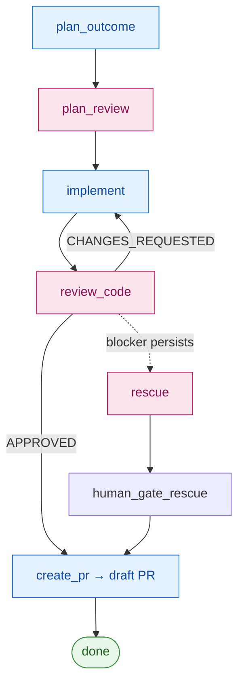

# redteam

[](https://github.com/AscendyProject/redteam/actions/workflows/ci.yml)
[](LICENSE)


> 🌐 English: [README.md](README.md) · 한국어: 이 문서. 영어판이 정본(canon)이며,
> 충돌 시 영어판을 따릅니다.

AI로 코드를 출하하기 위한 **적대적 에이전트-페어(agent-pair)** 하네스. 한 모델이
태스크를 파이프라인(plan → implement → review)으로 몰아가고, **다른** 모델이 그
작업을 적대적으로 리뷰하며, 결과물은 머지 전에 당신이 검토하는 **draft PR**이다.
독립적인 두 모델 관점의 충돌이 핵심이다 — 자동적인 자기 동의(self-agreement)를
막는 것이 이 도구의 존재 이유다. (`write_test → verify_test`를 앞단에 두는 단일 모델
**TDD** 모드도 있다 — [모드별 단계](#모드별-단계) 참조.)

> 상태: 초기 단계. redteam은 한 프로젝트의 내부 하네스로 만들어진 뒤 이 독립 repo로
> 추출되었고, 앞으로는 이 repo가 소유한다 — 실제로 머지된 PR들을 구동해 왔다. (초기
> git history에는 그 기원, 즉 상위 프로젝트와의 cross-repo 조율 흔적이 남아 있다.)
> API와 레이아웃은 아직 바뀔 수 있다.

**빠른 설치 (Claude Code) — 두 줄:**

```text
/plugin marketplace add https://github.com/AscendyProject/redteam
/plugin install redteam@ascendy-redteam
```

Claude Code를 안 쓴다면? 어떤 repo에든 vendoring할 수 있다 — [설치](#설치) 참조.

## 무엇을 하나

태스크 묶음(각각 짧은 `input.md` 브리프)을 주면, 오케스트레이터가 모든 태스크를
고정된 파이프라인으로 돌리고, 각 단계 후 `state.json`을 저장해 실행을 완전히
재개(resume) 가능하게 하며, `CHANGES_REQUESTED`에서는 재시도한다:



<sub>파랑 = **worker** 모델(작성) · 분홍 = **reviewer** 모델(적대적, 매번 새로 시작).</sub>

이것이 기본 **agent-pair** 흐름이다. 설계상 **공통 경로에 사람 게이트가 없다** —
적대적 페어 + 검증이 곧 신뢰이고, 결과물은 (auto-merge가 아니라) **draft PR**(머지
전 당신의 기존 사람 체크포인트)이다. 사람 게이트는 위험한 변경에 대해 **다시 추가**
하는 것이지, 모든 변경에 매기는 기본 세금이 아니다 — [언제 쓰나](#언제-쓰나) 참조.

### 모드별 단계

`mode`(기본 `agent-pair`, 또는 `tdd`)가 어떤 단계가 도는지를 결정한다. 정본은
`orchestrator.py`의 `_phase_order()`(`AGENT_PAIR_PHASE_ORDER` / `TDD_PHASE_ORDER`)
이며 — 파이프라인을 수동으로 돌릴 때는 산문이 아니라 선언된 모드의 행을 따라야 한다:

| 모드 | 핵심 단계 |
|------|-------------|
| `agent-pair` *(기본)* | `plan_outcome → plan_review → implement → review_code → create_pr` |
| `tdd` | `plan_outcome → write_test → verify_test → implement → review_code → create_pr` |

**agent-pair** worker는 테스트를 **`implement` 안에서** 직접 쓴다 — 별도의 테스트
작성 단계가 없으며, 두 번째 관점은 적대적 **reviewer**(`review_code`)이고, 계획은
`plan_review`가 독립적으로 점검한다. **TDD** 모드는 대신 `plan_review`를 빼고
`implement` 앞에 `write_test → verify_test` 쌍을 둔다. 따라서 `write_test` /
`verify_test`(test-author / test-verifier 서브 에이전트)는 **TDD 모드에서만** 돈다 —
agent-pair 태스크에 끼워 넣으면 그 모드가 제외한 단계를 돌리는 셈이다.

(표는 worker + reviewer 단계를 보여준다. `rescue` 슬롯은 blocker가 여러 리뷰 라운드를
넘겨 살아남을 때만 진입한다 — 무-티어 기본에서는 rescue 후 PR 전에 사람이 검토한다
(`human_gate_rescue`). 계획 승인 게이트는 [티어 프로파일](#언제-쓰나)별 opt-in이다.)

각 단계는 자체 프롬프트와 도구 범위를 가진 집중형 서브 에이전트가 돌린다
(`.claude/agents/*.md`): outcome-planner, implementer, code-security-reviewer,
pr-author — 그리고 **TDD 모드에서만** 쓰이는 test-author / test-verifier 쌍.
reviewer는 diff와 프로젝트 보안 체크리스트만 보는 *새* 에이전트다 — implementer의
추론 과정은 절대 보지 않는다.

## 왜 교차검증인가?

redteam은 "코드를 만든 모델이 그 코드의 안전성까지 스스로 판단해서는 안 된다"는
전제에서 출발한다. 같은 계열 모델의 두 번째 패스는 자기 자신과 동의하는 경향이
있다 — 리뷰가 diff에 반론을 제기하는 대신 도장을 찍는다(rubber-stamp).

그래서 하네스는 역할을 분리하고, 리뷰를 **다른 계열**의 모델에게 맡겨 그 도장을
거부하게 한다:

- **계획** — 고수준 아키텍처, 트레이드오프, 플랜 품질
- **구현** — 실제 코드, 반복 작업, 토큰 효율
- **리뷰** — 독립 리뷰어가 보안·확장성·정확성·프로덕션 리스크를 독립적으로 검토
- **사람** — 최종 머지 통제

목표는 엔지니어의 판단을 대체하는 것이 아니다. AI로 생성된 코드를 실제 제품에 넣기
전에 더 엄격하고 독립적인 리뷰 경계를 통과시키는 것이다.

> 현재 설정 (2026): 계획 Claude Opus, 구현 Claude Sonnet, 리뷰 Codex. 이는 현재
> 구성일 뿐이며, redteam의 정체성은 역할 분리와 계열 교차 리뷰이지 특정 모델 조합이
> 아니다. 양쪽에 어느 모델이든 둘 수 있다 — [모델 자유](#모델-자유) 참조.

## 무엇이 다른가

평범한 "2-모델" 구성은 *두 번째 모델이 한 번 더 본다*에서 멈춘다. redteam은 그 분리를
구조화하고 그에 따라 행동한다:

- **결과(finding)는 통과/실패가 아니라 등급화된다.** reviewer는 심각도(`blocker` /
  `major` / `minor`)를 붙여 finding을 내고, 오케스트레이터는 각 finding을 *리뷰 라운드
  전반에 걸쳐* 추적한다(carry-over 카운트) — 리뷰는 한 번의 엄지척/엄지다운이 아니다.
- **지속되는 문제는 사다리를 타고 에스컬레이트한다.** 여러 라운드를 살아남은 blocker는
  올라간다: worker 재시도 → 더 무거운 `rescue` 패스 → 사람에게 인계(`ask_user`).
  그래서 한 번의 반려가 실행을 죽이지 않고, 끈질긴 진짜 버그가 단 한 번의 재시도 뒤
  도장 받지 않는다.
- **reviewer는 writer를 보지 못한다.** 새 에이전트 — 그리고 설정으로 *다른* 모델 — 이
  diff와 보안 체크리스트만 보고 implementer의 추론은 보지 않으므로, 자기 정당화가
  경계를 넘지 못한다.
- **draft PR이 사람 체크포인트이고, 기본 공통 경로엔 게이트가 없다.** 페어 + 검증이
  자동화된 신뢰이므로, 결과물은 머지 전 검토하는 **draft PR**이며 — 절대 자율 머지하지
  않는다. 차단형 사람 게이트(계획 승인 등)는 위험한 변경에 대해 **티어별 opt-in**이지
  기본이 아니다.
- **양쪽 어느 모델이든, 런타임 의존성 0.** [모델 자유](#모델-자유)와 [설치](#설치) 참조.

## 모델 자유

역할(role)은 하드코딩된 호출이 아니라 작은 어댑터 레지스트리를 통해 프로바이더에
바인딩된다. 현재 Claude와 Codex는 각각 **어느** 쪽이든 맡을 수 있다:

| 역할 | 구현된 프로바이더 |
|------|-----------------------|
| worker (planner / implementer) | `claude`, `codex` |
| reviewer / rescue | `codex`, `claude` |

`.redteam/config.toml [models]`에서 역할별로 고른다. 어댑터가 아닌 reviewer 값(예:
`"human"`)은 수동 흐름으로 폴백한다(리뷰를 붙여넣고 sentinel을 건드린다). 다른
프로바이더 추가는 어댑터 파일 하나 + 레지스트리 한 줄이다.

기본 배포는 worker로 Claude, reviewer로 Codex를 싣는다. 이를 **뒤집으려면** — Codex가
코드를 쓰고 Claude가 적대적으로 리뷰("Codex main, Claude sub") — 네 역할을 뒤집는다:

```toml
[models]
planner     = "codex"     # worker: Codex가 계획 + 코드 작성
implementer = "codex"
reviewer    = "claude"    # reviewer: Claude, 읽기 전용, 적대적
rescue      = "claude"
```

오케스트레이터는 평범한 Python CLI라, `codex`와 `claude` CLI가 설치·인증된 **어떤
셸에서든** 돈다 — Claude Code가 필요 없다. (Claude Code 플러그인은 Claude-Code
사용자를 위한 하나의 전달 표면일 뿐이고, cross-provider 페어링 자체는 엔진 레벨
설정이며 동일한 `.claude/agents/*.md` 스켈레톤이 두 프로바이더를 모두 구동한다.)
자기-리뷰 가드는 여전히 적용된다: worker와 reviewer는 *서로 다른* 프로바이더로
해석되어야 한다.

## 언제 쓰나

목표는 **신뢰를 잃지 않으면서 사람 개입을 최소화**하는 것이다 — 적대적 페어가
자동화된 신뢰이므로 공통 경로에 사람 게이트가 없다. 하지만 모든 변경이 같은 무게를
요구하진 않는다: 오타가 풀 agent-pair 비용을 치를 필요는 없고, 인증 변경이 가벼운
경로로만 출하돼선 안 된다. 그래서 **변경의 위험에 비례해 대응을 조절한다**:

| 변경 | 대응 |
|---|---|
| 사소함 — 동작 불변(리네임, 주석, 포매팅) | 단일 에이전트, 리뷰 없음 |
| 일상 — 작고 국소적이며 되돌릴 수 있음 | 단일 에이전트 루프; 리뷰 선택 |
| **주의(guarded)** — 실제 파급이 있는 동작 변경(인증, 저장소, 동시성, 공개 API, 마이그레이션) | 적대적 페어 + 검증 (기본) |
| **전략적 / 프로덕션 핵심** — 아키텍처적, 비가역적, 또는 프로덕션 태세를 바꿈 | 페어 **+ 사람 게이트** (그리고 당신이 요구하는 롤백 계획) |

**티어 기반 라우팅**은 이를 자동 적용하게 한다(`config.toml`로 opt-in). 티어
프로파일을 선언적 토글로 정의하고, 결정론적 분류기가 각 태스크의 티어를 고른다:

```toml
[tiers.0]                       # 사소함
review = false                  # 단일 에이전트, 적대적 페어 없음
models = { implementer = "claude-haiku-4-5" }   # 저렴한 모델

[tiers.2]                       # 주의 (합리적 기본값)
review = true                   # 적대적 페어; 사람 게이트 없음

[tiers.4]                       # 프로덕션 핵심
review = true
gates = ["outcome", "pr"]       # 여기서 사람 체크포인트를 다시 추가

[tier_triggers]
"**/auth/**" = 4                # auth를 건드리면 태스크를 티어 4로 바닥 고정
default = 2                     # 미분류 → 안전한 기본값
```

바인딩 티어는 `max(선언값, 경로-트리거값, 기본값)`이다 — 태스크는 **올릴** 수는 있어도
경로가 요구하는 값 아래로 내릴 수 없으며, 미분류 태스크는 강제 안전 기본값으로
떨어진다. `[tiers]` 섹션이 없으면 라우팅은 꺼지고 모든 태스크가 기본 파이프라인을
탄다(완전 하위 호환).

두 레버는 티어 없이도 단독으로 동작한다:

- **역할별 모델**(`[models]`) — 일상 작업엔 더 저렴한 implementer, 주의 작업엔 프런티어
  reviewer; 양쪽 어느 프로바이더든.
- **에스컬레이션 사다리** — 리뷰 라운드를 살아남은 `blocker` finding이 retry →
  `rescue`로 올라가, 문제가 실제로 지속되는 곳에 노력을 집중시킨다.

트리거 glob은 git-pathspec 스타일이다: `*`는 한 경로 세그먼트 내에서, `**`는 디렉터리를
가로질러 매칭한다(그래서 `**/auth/**`는 임의 깊이의 `auth/x`에 매칭).

> 범위 메모: v1 경로 트리거는 태스크가 front-matter에 *선언한* 경로에 매칭하며, 티어
> 프로파일은 표준 파이프라인에 대해 review/gates/models를 변주한다(임의 단계 순서가
> 아님). 실제 커밋된 diff 재확인과 더 풍부한 프로파일은
> [issue #13](https://github.com/AscendyProject/redteam/issues/13)에서 추적한다.

## 설치

### Claude Code 플러그인으로 (권장)

이 repo는 단일 플러그인 마켓플레이스를 겸하므로 두 줄이면 설치된다:

```text
/plugin marketplace add https://github.com/AscendyProject/redteam
/plugin install redteam@ascendy-redteam
```

> HTTPS URL은 SSH(포트 22)를 막는 방화벽 뒤를 포함해 어디서나 동작한다.
> GitHub SSH 키가 설정돼 있으면 `AscendyProject/redteam` 단축형도 동작한다.

이로써 일곱 개 서브 에이전트와 `/redteam:*` 명령이 등록된다. `/redteam`만 치면
피커가 아래 여덟 서브커맨드로 좁혀진다. 프로젝트 루트에서
`redteam-install`(PATH의 `redteam-install` 도구로도 노출)을 돌려 하네스를 vendoring한
뒤, 나머지를 필요에 따라 쓴다:

```text
/redteam:install         # .redteam/를 현재 repo에 vendoring
/redteam:new-task        # 템플릿에서 다음 task-NNN 디렉터리 + input.md 스캐폴드
/redteam:goal            # goal 모드: goal.md를 스택형 태스크 DAG로 분해 후 실행
/redteam:start           # 배치의 태스크를 파이프라인에 태워 실행 (첫 실행)
/redteam:resume          # 게이트/실패/보류 이후 진행 중인 배치 이어가기
/redteam:status          # 배치의 파이프라인 상태 표시
/redteam:review          # 현재 브랜치 diff에 대한 일회성 cross-model 리뷰
/redteam:config          # 역할별 모델 선택 (writer / reviewer / rescue)
```

### 또는 직접 vendoring (어떤 스택이든, Claude Code 불필요)

```bash
# 이 repo의 클론에서:
python3 .redteam/scripts/install.py /path/to/your/project

# 먼저 미리보기:
python3 .redteam/scripts/install.py /path/to/your/project --dry-run
```

유용한 플래그: `--overwrite`(하네스 소유 파일 갱신; 당신의 `config.toml` / `docs/*` /
`batches/`는 절대 안 건드림), `--protect-config`(opt-in: 컨슈머의
`.claude/settings.json`에 `.redteam/config.toml`에 대한 Claude Code `Edit/Write` 거부
규칙을 add-only로 추가 — 어쨌든 런타임 페어링 가드가 백스톱이다), `--check`(vendoring된
설치가 이 하네스 버전보다 뒤처졌는지 보고하고 종료 — 아무것도 쓰지 않음).

어느 방식이든 같은 vendoring 모델이다: 엔진이 자기 파일 위치로부터 당신의 repo 루트를
해석하기 때문에 하네스는 당신의 프로젝트 트리 *안에*(`.redteam/`) 들어간다. 하네스 소유
파일(`workflows/`, `prompts/`, `templates/`, 에이전트 스켈레톤)은 매 실행마다 다시
vendoring된다(`--overwrite`로 갱신); 프로젝트 소유 파일(`config.toml`, `docs/*`,
`verify.sh`, 당신의 `batches/`)은 한 번만 시드되고 절대 덮어쓰지 않는다.

설치 스크립트는 하네스 자체의 유닛 테스트는 vendoring하지 **않으므로**, 컨슈머는 그것을
돌리거나 유지보수할 일이 없다 — 당신의 `verify.sh`는 엔진 테스트가 아니라 *당신의*
테스트를 돌린다. vendoring된 `.redteam/` 엔진은 하네스 자체의 스타일을 따르므로,
당신이 소유하지 않은 코드를 린터가 지적하지 않도록 **`.redteam/`를 프로젝트의
린터/포매터에서 제외**하라(예: ruff의 `extend-exclude`, eslint ignore).

### 요구사항

- Python 3.11+ (stdlib만 — 런타임 pip 의존성 0).
- 당신이 설정하는 모델 CLI들, 설치·인증된 상태:
  [`claude`](https://claude.com/claude-code) 및/또는 `codex`.

## 업데이트

vendoring된 설치는 당신 repo 안의 엔진 *복사본*이므로 스스로 업데이트하지 않는다 — 새
버전이 나오면 다시 vendoring한다. `--overwrite`는 하네스 소유 트리(`workflows/`,
`prompts/`, `templates/`, `scripts/install.py`, 일곱 에이전트 스켈레톤,
`.redteam/.redteam-version` 스탬프)만 갱신한다; 기존 프로젝트 소유 파일(`config.toml`,
`docs/*`, `verify.sh`)과 `batches/` 아래 태스크 내용은 절대 덮어쓰지 않는다(설치
스크립트는 거기 add-only `batches/.gitignore` 규칙만 보장하고 당신 파일은 그대로 둔다).

> `--check`는 **소스** 쪽을 당신의 vendoring된 스탬프와 비교하므로, 소스가 *더 새것*일
> 때만 의미가 있다 — 업데이트된 플러그인(`redteam-install …`)이나 새 클론에서 돌려라.
> 당신 repo 자신의 vendoring된 `.redteam/scripts/install.py`를 같은 repo에 돌리면
> 스탬프를 자기 자신과 비교하므로 상위 릴리스를 드러낼 수 없다(vendoring된 버전을 그냥
> 메아리치거나, 스탬프가 없으면 `unknown`). 종료 코드: `0` 최신/앞섬 · `1` 구버전 ·
> `2` 판단 불가. 아무것도 쓰지 않는다.

### 플러그인 설치 (Claude Code)

플러그인은 엔진을 싣고 `redteam-install`을 PATH에 둔다. 그래서 업데이트는 두 층이다 —
먼저 플러그인을 갱신하고, 그것이 담은 엔진을 다시 vendoring한다:

```text
/plugin marketplace update ascendy-redteam   # 캐시된 마켓플레이스 갱신
/plugin update redteam@ascendy-redteam       # 플러그인을 최신으로 업데이트
/plugin list                                 # 새 버전 확인
/reload-plugins                              # 갱신된 명령/에이전트 적용 (재시작 불필요)
```

그런 다음 엔진을 당신 repo에 다시 vendoring하고 확인한다. `redteam-install`이
*플러그인*의 (이제 갱신된) 소스를 자체 탐지하므로, 그 `--check`는 그것을 당신 repo의
vendoring된 스탬프와 의미 있게 비교한다:

```bash
redteam-install . --check        # 플러그인 소스 vs 당신의 vendoring 스탬프: 1 = 구버전
redteam-install . --overwrite    # 새 엔진을 .redteam/에 다시 vendoring
redteam-install . --check        # "verdict: up-to-date." 기대
bash .redteam/scripts/verify.sh  # 당신의 게이트는 여전히 통과
```

### 직접(vendoring) 설치

이 repo(당신의 클론)의 최신을 pull한 뒤, **클론의** 설치 스크립트를 당신 프로젝트에
돌려 소스 쪽이 갱신된 것이 되게 한다:

```bash
# 이 repo의 새로 갱신한 클론에서:
python3 /path/to/redteam-clone/.redteam/scripts/install.py /path/to/your/project --check
python3 /path/to/redteam-clone/.redteam/scripts/install.py /path/to/your/project --overwrite
```

업데이트는 브랜치에서 하고 PR을 열어라(엔진 범프를 기본 브랜치에 바로 푸시하지 말 것).
그리고 [설치](#설치)에서처럼 `.redteam/`를 린터에서 제외한 채로 유지하라.

## 설정

당신의 스택에 맞게 `.redteam/config.toml`을 편집하고(경로, `verify_command`,
`branch_prefix`, 역할→모델), 서브 에이전트가 읽는 세 프로젝트 문서를 채운다:

- `.redteam/docs/project-context.md` — 스택 + 하드 룰
- `.redteam/docs/security-checklist.md` — reviewer의 하드 라인
- `.redteam/docs/test-conventions.md` — 당신의 테스트 스위트 구성 방식

형태를 베껴 올 완전한 예제 둘: `examples/fastapi-like/`(Python — FastAPI + Celery +
Postgres + 벡터 DB)와 `examples/nuxt-like/`(JS/TS — Nuxt 3 + Vue + Vitest).

## 실행

```bash
python3 .redteam/workflows/orchestrator.py new    .redteam/batches/<batch> <slug> [--title "..."]
python3 .redteam/workflows/orchestrator.py start  .redteam/batches/<batch>
python3 .redteam/workflows/orchestrator.py resume .redteam/batches/<batch>
python3 .redteam/workflows/orchestrator.py status .redteam/batches/<batch> [--json]
```

배치는 `tasks/<task-id>/input.md` 브리프들의 디렉터리다. `new`는 템플릿 `input.md`와
함께 다음 `task-NNN` 디렉터리를 스캐폴드한다(또는 `/redteam:new-task` 사용);
브리프를 채운 뒤 `start`. 오케스트레이터는 태스크별 브랜치
(`<branch_prefix>/<task-id>`)를 만들고 파이프라인을 돌리며, 각 사람 게이트에서 그것이
지정하는 sentinel 파일을 당신이 건드릴 때까지 멈춘다. `status --json`은 같은
리포트를 기계가 읽을 수 있게 낸다(태스크별 phase, deferral — 원시 실패 로그는 절대
포함하지 않음 — 그리고 goal 진행률). PR 게이트에 막힌 태스크는 `wait-and-resume`이
`gh pr view`로 GitHub을 폴링해 PR이 머지/클로즈되면 자동으로 전진시킨다.

**일회성 리뷰 (배치 없이).** 현재 브랜치 diff에 대해 적대적 reviewer만 — 코드를 쓴
쪽과 *다른* 프로바이더로, 읽기 전용 — 돌리려면:

```bash
python3 .redteam/workflows/orchestrator.py review
```

`git diff <base>...HEAD`를 리뷰하고 `0` / `1` / `2`(승인 / 변경 요청 / reviewer 실패)로
종료하므로 CI를 게이트할 수 있다. Claude Code에서는 `/redteam:review`로 노출.
Fail-closed: 설정된 reviewer가 worker 자신의 프로바이더로 붕괴(self-review)하면
거부한다.

## Goal 모드

위의 배치는 손으로 쓴 것이다 — 각 `tasks/<id>/input.md`를 직접 작성한다. **Goal
모드**는 한 단계 위에서 시작하게 해준다: 사람이 쓴 `goal.md` 하나만 두면, 하네스가
그것을 의존 순서가 잡힌 태스크 묶음으로 분해해 하나의 합성 파이프라인으로 돌린다.

```bash
# 1. 목표를 쓴다 (원하는 것을 끝에서 끝까지)
#    .redteam/batches/<batch>/goal.md

# 2. 태스크 DAG로 분해 — goal.json + 태스크별 tasks/<id>/input.md 생성
python3 .redteam/workflows/orchestrator.py decompose .redteam/batches/<batch>

# 3. 합성된 배치를 부모-우선으로 실행 (start/resume/status는 일반 배치와 동일)
python3 .redteam/workflows/orchestrator.py start  .redteam/batches/<batch>
python3 .redteam/workflows/orchestrator.py status .redteam/batches/<batch>
```

`decompose`는 `goal-decomposer` 서브 에이전트를 돌려 `goal.md`를 **단일 부모 DAG
매니페스트**(`goal.json`)와 태스크별 브리프로 바꾸며, 그 분해 자체가 어떤 태스크도
시드되기 전에 **cross-provider 리뷰**로 검증된다. 그다음 스케줄러는 태스크를
**부모-우선**으로 돌리고, 각 의존 태스크는 **부모 브랜치 위에 스택**된다 — 리뷰 범위, PR
베이스, 변경 경로가 모두 `parent-branch...HEAD`로 핀되므로, 각 드래프트 PR은 딱 그
태스크의 delta만 보여주고 스택은 부모-우선으로 머지된다.

가드 레일은 전 구간 fail-closed다:

- **다중 부모 태스크**(≥2개에 의존)는 v1에서 **거부**된다 — goal 모드는 단일 부모
  *포레스트*이고, 다중 부모는 향후 작업이다.
- `ceilings.max_tasks`는 매니페스트와 일치해야 하며, 아니면 **어떤 시드도 하기 전에 배치
  전체가 중단**된다.
- **이동한 부모 tip / 잘못 재사용된 베이스는 fail-closed**다(부모 tip은 핀 시점에
  동결됨) — 잘못 스택된 의존 태스크를 조용히 만들지 않는다.
- **deferred/실패한 부모**는 자손을 `blocked_on_dependency`로 둔다(스킵-후-계속; v1에
  자동 재계획 없음).

드래프트 PR 스택은 여전히 사람 체크포인트다 — goal 모드는 태스크를 합성할 뿐, 대신
머지해 주지는 않는다.

Claude Code에서는 `/redteam:goal`이 이 전체를 **자율적으로** 끌고 간다: 분해하고,
스택을 시작하고, 그 뒤로도 계속 운영한다 — `status --json`을 읽고, deferred/실패한
태스크를 진단하고, 에이전트가 고쳐도 되는 것(일시적 인프라 문제, 스테일 태스크
브랜치, 원인을 해소한 sticky deferral, 결함 있는 decomposer 작성 브리프 —
`goal.md`의 의도 안에서)을 조치하고, resume한다 — 모든 태스크의 드래프트 PR이
열리거나 진짜 사람의 결정이 필요해질 때까지(fail-closed: 분해 거부, 반복되는
deferral, 보안 경계를 건드리는 것은 루프를 멈춘다). 머지는 절대 하지 않는다.

## 이 프로젝트가 나온 배경

redteam은 Ascendy를 AI 코딩 에이전트와 함께 만들던 과정에서 시작됐다.

바이브코딩은 작은 팀이 빠르게 제품을 만들 수 있게 해주지만, 동시에 다른 문제를
드러낸다. AI가 만든 코드는 그럴듯해 보이고, 얕은 테스트를 통과하고, 두 번째 모델의
리뷰까지 통과할 수 있지만, 실제 프로덕션에서 중요한 제품 제약을 어길 수 있다.

Ascendy가 미디어 저장, 메타데이터 처리, 검색, 인증, 유저 데이터 흐름을 가진 실제
제품으로 커질수록, 단순히 두 번째 모델에게 "리뷰해줘"라고 맡기는 것만으로는
부족했다. 작성자와 다른 계열의 리뷰어가 diff를 독립적으로 검토하도록 강제하고,
최종 머지는 사람이 통제하는 하네스가 필요했다.

redteam은 그 워크플로우를 오픈소스로 추출한 것이다. 이 repo는 Ascendy 제품
코드베이스가 아니다 — AI로 만든 소프트웨어를 실제로 배포 가능한 수준까지 끌어올리기
위해 탄생한 검증 하네스다.

## 기여

이슈와 PR 환영. dev 셋업과 게이트(`bash .redteam/scripts/verify.sh`)는
[CONTRIBUTING.md](.github/CONTRIBUTING.md), 행동 강령은
[Code of Conduct](.github/CODE_OF_CONDUCT.md)를 보라. 엔진은 프로젝트 비종속 +
stdlib 전용을 유지한다 — 이 두 불변식이 대부분의 리뷰 피드백을 좌우한다. 취약점 신고는
[SECURITY.md](.github/SECURITY.md)를 보라(공개 이슈를 열지 말 것).

## 라이선스

Apache License 2.0 (`LICENSE`). 기여는
[Contributor License Agreement](CLA.md) 하에 받으며, 이는 출처(provenance)를 깨끗이
유지하고 다른 조건으로 프로젝트를 제공할 선택지를 보존한다.
