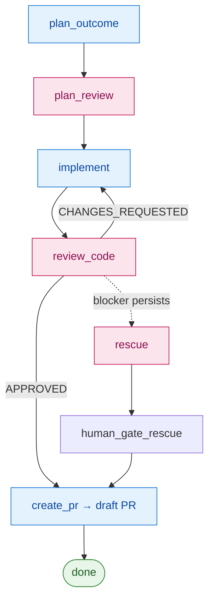

# redteam

[](https://github.com/AscendyProject/redteam/actions/workflows/ci.yml)
[](LICENSE)


> 🌐 한국어: [README.ko.md](README.ko.md). This English document is canonical.

An adversarial **agent-pair** harness for shipping code with AI. One model
drives a task through a pipeline (plan → implement → review); a
**different** model reviews the work adversarially; the output is a draft PR you
review before merge. The collision of two independent model perspectives is the
point — automatic self-agreement is what it exists to prevent. (A single-model
**TDD** mode that front-loads `write_test → verify_test` is also available — see
[Phases by mode](#phases-by-mode).)

> Status: early. redteam was built as one project's internal harness and then
> extracted into this standalone repo, which owns it going forward — it has
> driven real, merged pull requests. (Its early git history reflects that origin,
> including cross-repo coordination from the parent project.) APIs and layout may
> still move.

**Quick install (Claude Code) — two commands:**

```text
/plugin marketplace add https://github.com/AscendyProject/redteam
/plugin install redteam@ascendy-redteam
```

Not on Claude Code? Vendor it into any repo — see [Install](#install).

## What it does

Given a batch of tasks (each a short `input.md` brief), the orchestrator walks
every task through a fixed pipeline, persisting `state.json` after each phase so
a run is fully resumable and retrying on `CHANGES_REQUESTED`:



<sub>Blue = **worker** model (writes) · pink = **reviewer** model (adversarial, fresh).</sub>

This is the default **agent-pair** flow. By design it runs with **no human gates
in the common path** — the adversarial pair plus verification *is* the trust, and
the output is a **draft PR** (your existing human checkpoint before merge), not an
auto-merge. Human gates are something you **add back for risky changes**, not the
default tax on every change — see [When to use it](#when-to-use-it).

### Phases by mode

`mode` (`agent-pair` by default, or `tdd`) decides which phases run. The
authority is `_phase_order()` in `orchestrator.py` (`AGENT_PAIR_PHASE_ORDER` /
`TDD_PHASE_ORDER`) — driving the pipeline manually must follow the row for the
declared mode, not the prose:

| Mode | Core phases |
|------|-------------|
| `agent-pair` *(default)* | `plan_outcome → plan_review → implement → review_code → create_pr` |
| `tdd` | `plan_outcome → write_test → verify_test → implement → review_code → create_pr` |

The **agent-pair** worker writes its tests **inside `implement`** — there is no
separate test-authoring phase; the second perspective is the adversarial
**reviewer** (`review_code`), and the plan is independently checked by
`plan_review`. The **TDD** mode instead drops `plan_review` and front-loads a
`write_test → verify_test` pair before `implement`. So `write_test` /
`verify_test` (the test-author / test-verifier sub-agents) run in **TDD mode
only** — inserting them into an agent-pair task runs a phase the mode excludes.

(The table shows the worker + reviewer phases. A `rescue` slot is entered only if
a blocker persists across review rounds — in the untiered default a rescue is then
human-reviewed (`human_gate_rescue`) before the PR. A plan-approval gate is opt-in
per [tier profile](#when-to-use-it).)

Each phase is run by a focused sub-agent with its own prompt and tool scope
(`.claude/agents/*.md`): an outcome-planner, implementer, code-security-reviewer,
and pr-author — plus a test-author / test-verifier pair used **only in TDD mode**.
The reviewer is a *fresh* agent that only sees the diff and the project's
security checklist — it never sees the implementer's reasoning.

## Why cross-review?

redteam is built around one assumption: the model that writes the code should
not be the only model that judges whether it is safe to ship. A second pass from
the *same* model family tends to agree with itself — the review rubber-stamps the
diff instead of pushing back on it.

So the harness separates the roles and hands the review to a **different** model
family, whose job is to refuse that rubber stamp:

- **Planning** — high-level architecture, tradeoffs, plan quality
- **Implementation** — the actual code, iteration, token efficiency
- **Review** — an independent reviewer challenges the diff for security,
  scalability, correctness, and production risk
- **Humans** keep control over the final merge

The goal is not to replace engineering judgment. It is to make AI-assisted code
pass through a stricter, independent review boundary before it reaches a real
product.

> Current setup (2026): Claude Opus for planning, Claude Sonnet for
> implementation, Codex as the independent reviewer. This is just our current
> configuration — the identity of redteam is the role separation and
> cross-family review, not any specific model lineup. See
> [Model freedom](#model-freedom) to put either model on either side.

## How it's different

A plain "two-model" setup stops at *a second model takes a second look*. redteam
makes that separation structural and then acts on it:

- **Findings are tiered, not pass/fail.** The reviewer emits findings with a
  severity (`blocker` / `major` / `minor`), and the orchestrator tracks each one
  *across review rounds* (a carry-over count) — a review is not a single thumbs
  up/down.
- **Persistent problems escalate on a ladder.** A blocker that survives multiple
  rounds climbs: retry the worker → a heavier `rescue` pass → hand to a human
  (`ask_user`). So one rejection doesn't kill a run, and a stubborn real bug
  doesn't get rubber-stamped after a single retry.
- **The reviewer is blind to the writer.** It's a fresh agent — and a
  configurably *different* model — that sees only the diff and the security
  checklist, never the implementer's reasoning, so self-justification can't
  cross the boundary.
- **The draft PR is the human checkpoint; the default common path has no gates.**
  The pair plus verification is the automated trust, so the output is a **draft
  PR** you review before merge — it never autonomously merges. Blocking human
  gates (plan approval, etc.) are **opt-in per tier** for risky changes, not the
  default.
- **Either model on either side, zero runtime deps.** See
  [Model freedom](#model-freedom) and [Install](#install).

## Model freedom

Roles bind to providers through a small adapter registry, not hardcoded calls.
Today Claude and Codex can each take **either** side:

| role | providers implemented |
|------|-----------------------|
| worker (planner / implementer) | `claude`, `codex` |
| reviewer / rescue | `codex`, `claude` |

You choose per role in `.redteam/config.toml [models]`. A reviewer value that
isn't an adapter (e.g. `"human"`) falls back to the manual flow (you paste the
review and touch the sentinel). Adding another provider is one adapter file plus
one registry line.

The default ships Claude as the worker and Codex as the reviewer. To **reverse
it** — Codex writes the code, Claude reviews it adversarially ("Codex main, Claude
sub") — flip the four roles:

```toml
[models]
planner     = "codex"     # worker: Codex plans + writes the code
implementer = "codex"
reviewer    = "claude"    # reviewer: Claude, read-only, adversarial
rescue      = "claude"
```

The orchestrator is a plain Python CLI, so this runs from **any shell** with the
`codex` and `claude` CLIs installed and authenticated — you don't need Claude
Code. (The Claude Code plugin is just one delivery surface for Claude-Code users;
the cross-provider pairing itself is engine-level config, and the same
`.claude/agents/*.md` skeletons drive both providers.) The self-review guard still
applies: worker and reviewer must resolve to *different* providers.

## When to use it

The goal is **minimal human intervention, without losing trust** — the
adversarial pair is the automated trust, so the common path has no human gates.
But not every change needs the same weight: a typo shouldn't pay for a full
agent-pair, and an auth change shouldn't ship with only the light path. So you
**scale the response to the risk of the change**:

| change | response |
|---|---|
| trivial — non-behavior-changing (rename, comment, formatting) | single-agent, no review |
| routine — small, local, reversible | single-agent loop; review optional |
| **guarded** — behavior change with real blast radius (auth, storage, concurrency, public API, migrations) | the adversarial pair + verification (the default) |
| **strategic / production-critical** — architectural, irreversible, or changes prod posture | the pair **plus human gates** (and a rollback plan you require) |

**Tier-aware routing** lets the harness apply this automatically (opt-in via
`config.toml`). You define tier profiles as declarative toggles, and a
deterministic classifier picks each task's tier:

```toml
[tiers.0]                       # trivial
review = false                  # single-agent, no adversarial pair
models = { implementer = "claude-haiku-4-5" }   # cheap model

[tiers.2]                       # guarded (a sensible default)
review = true                   # the adversarial pair; no human gate

[tiers.4]                       # production-critical
review = true
gates = ["outcome", "pr"]       # add human checkpoints back here

[tier_triggers]
"**/auth/**" = 4                # touching auth floors the task at tier 4
default = 2                     # unclassified → safe default
```

The binding tier is `max(declared, path-triggered, default)` — a task can be
**raised** but never lowered below what its paths demand, and an unclassified task
falls to the mandatory safe default. With no `[tiers]` section, routing is off and
every task takes the default pipeline (fully backward-compatible).

Two levers also work on their own, without tiers:

- **Model per role** (`[models]`) — a cheaper implementer for routine work, a
  frontier reviewer for guarded work; either provider on either side.
- **The escalation ladder** — a `blocker` finding that survives review rounds
  climbs retry → `rescue`, concentrating effort where a problem actually persists.

Trigger globs are git-pathspec-style: `*` matches within a path segment, `**`
matches across directories (so `**/auth/**` matches `auth/x` at any depth).

> Scope note: v1 path triggers match the paths a task *declares* in its
> front-matter, and tier profiles vary review/gates/models over the canonical
> pipeline (not arbitrary phase orders). Re-checking the real committed diff and
> richer profiles are tracked on
> [issue #13](https://github.com/AscendyProject/redteam/issues/13).

## Install

### As a Claude Code plugin (recommended)

This repo doubles as a single-plugin marketplace, so two commands install it:

```text
/plugin marketplace add https://github.com/AscendyProject/redteam
/plugin install redteam@ascendy-redteam
```

> The HTTPS URL works everywhere, including behind firewalls that block SSH
> (port 22). The `AscendyProject/redteam` shorthand also works if you have
> GitHub SSH keys configured.

That registers the seven sub-agents and the `/redteam:*` commands. Type
`/redteam` and the picker filters to the eight subcommands below. Run
`redteam-install` (also exposed as a `redteam-install` tool on PATH) from your
project root to vendor the harness in, then use the others as needed:

```text
/redteam:install         # vendor .redteam/ into the current repo
/redteam:new-task        # scaffold the next task-NNN dir + input.md from the template
/redteam:goal            # goal mode: decompose a goal.md into a stacked task DAG, then run it
/redteam:start           # run a batch's tasks through the pipeline (first run)
/redteam:resume          # continue an in-progress batch after a gate/failure/deferral
/redteam:status          # show the pipeline status for a batch
/redteam:review          # one-shot cross-model review of the current branch diff
/redteam:config          # choose the per-role models (writer / reviewer / rescue)
```

### Or vendor directly (any stack, no Claude Code needed)

```bash
# from a clone of this repo:
python3 .redteam/scripts/install.py /path/to/your/project

# preview first:
python3 .redteam/scripts/install.py /path/to/your/project --dry-run
```

Useful flags: `--overwrite` (refresh harness-owned files; never touches your
`config.toml` / `docs/*` / `batches/`), `--protect-config` (opt-in: add Claude
Code `Edit/Write` deny rules for `.redteam/config.toml` to the consumer's
`.claude/settings.json`, add-only — the runtime pairing guard is the backstop
regardless), and `--check` (report whether a vendored install is behind this
harness version, then exit — writes nothing).

Either way it's the same vendoring model: the harness ships *inside* your project
tree (`.redteam/`) because the engine resolves your repo root from its own file
location. Harness-owned files (`workflows/`, `prompts/`, `templates/`, agent
skeletons) are re-vendored on each run (`--overwrite` to refresh); project-owned
files (`config.toml`, `docs/*`, `verify.sh`, your `batches/`) are seeded once and
never overwritten.

The installer does **not** vendor the harness's own unit tests, so a consumer
never runs (or maintains) them — your `verify.sh` runs *your* tests, not the
engine's. The vendored `.redteam/` engine follows the harness's own style, so
**exclude `.redteam/` from your project's linter/formatter** (e.g. ruff's
`extend-exclude`, an eslint ignore) to avoid it flagging code you don't own.

### Requirements

- Python 3.11+ (stdlib only — zero runtime pip dependencies).
- The model CLIs you configure, installed and authenticated:
  [`claude`](https://claude.com/claude-code) and/or `codex`.

## Updating

A vendored install is a *copy* of the engine in your repo, so it doesn't update
itself — you re-vendor when a new version ships. `--overwrite` refreshes only
harness-owned trees (`workflows/`, `prompts/`, `templates/`, `scripts/install.py`,
the seven agent skeletons, and the `.redteam/.redteam-version` stamp); your existing
project-owned files (`config.toml`, `docs/*`, `verify.sh`) and your task content
under `batches/` are never overwritten (the installer only ensures an add-only
`batches/.gitignore` rule there, leaving your files intact).

> `--check` compares the **source** side against your vendored stamp, so it's only
> meaningful when the source is the *newer* one — run it from an updated plugin
> (`redteam-install …`) or a fresh clone. Running your repo's own vendored
> `.redteam/scripts/install.py` against that same repo compares the stamp to
> itself, so it can't reveal an upstream release (it just echoes the vendored
> version, or `unknown` if the stamp is missing). Exit codes: `0` current/ahead ·
> `1` outdated · `2` cannot determine. It writes nothing.

### Plugin installs (Claude Code)

The plugin ships the engine and puts `redteam-install` on PATH, so updating is
two layers — refresh the plugin first, then re-vendor the engine it carries:

```text
/plugin marketplace update ascendy-redteam   # refresh the cached marketplace
/plugin update redteam@ascendy-redteam       # update the plugin to the latest
/plugin list                                 # confirm the new version
/reload-plugins                              # apply updated commands/agents (no restart needed)
```

Then re-vendor the engine into your repo and confirm. Because `redteam-install`
self-locates the *plugin's* (now-updated) source, its `--check` meaningfully
compares that against your repo's vendored stamp:

```bash
redteam-install . --check        # plugin source vs your vendored stamp: 1 = outdated
redteam-install . --overwrite    # re-vendor the new engine into .redteam/
redteam-install . --check        # expect "verdict: up-to-date."
bash .redteam/scripts/verify.sh  # your gate still passes
```

### Direct (vendored) installs

Pull the latest of this repo (your clone), then run the **clone's** installer
against your project so the source side is the updated one:

```bash
# from your refreshed clone of this repo:
python3 /path/to/redteam-clone/.redteam/scripts/install.py /path/to/your/project --check
python3 /path/to/redteam-clone/.redteam/scripts/install.py /path/to/your/project --overwrite
```

Do the update on a branch and open a PR (don't push the engine bump straight to
your default branch), and keep `.redteam/` excluded from your linter as in
[Install](#install).

## Configure

Edit `.redteam/config.toml` for your stack (paths, `verify_command`,
`branch_prefix`, role→model), then fill the three project docs the sub-agents
read:

- `.redteam/docs/project-context.md` — stack + hard rules
- `.redteam/docs/security-checklist.md` — the reviewer's hard lines
- `.redteam/docs/test-conventions.md` — how your test suite is wired

Two complete examples to copy the shape from: `examples/fastapi-like/` (Python —
FastAPI + Celery + Postgres + a vector DB) and `examples/nuxt-like/` (JS/TS — Nuxt 3 +
Vue + Vitest).

## Run

```bash
python3 .redteam/workflows/orchestrator.py new    .redteam/batches/<batch> <slug> [--title "..."]
python3 .redteam/workflows/orchestrator.py start  .redteam/batches/<batch>
python3 .redteam/workflows/orchestrator.py resume .redteam/batches/<batch>
python3 .redteam/workflows/orchestrator.py status .redteam/batches/<batch> [--json]
```

A batch is a directory of `tasks/<task-id>/input.md` briefs. `new` scaffolds the
next `task-NNN` directory with a template `input.md` (or use
`/redteam:new-task`); fill in the brief, then `start`. The orchestrator
creates a per-task branch (`<branch_prefix>/<task-id>`), runs the pipeline, and
stops at each human gate until you touch the sentinel file it names.
`status --json` emits the same report machine-readable (per-task phase,
deferrals — never the raw failure log — plus goal progress); for tasks blocked
at a PR gate, `wait-and-resume` polls GitHub via `gh pr view` and advances
automatically once the PR is merged or closed.

**One-shot review (no batch).** To run just the adversarial reviewer over your
current branch diff — a *different* provider than whoever wrote the code,
read-only:

```bash
python3 .redteam/workflows/orchestrator.py review
```

It reviews `git diff <base>...HEAD` and exits `0` / `1` / `2` (approved /
changes requested / reviewer failed), so it can gate CI. Exposed as
`/redteam:review` in Claude Code. Fail-closed: it refuses if the
configured reviewer would collapse to the worker's own provider (self-review).

## Goal mode

Batches above are hand-authored — you write each `tasks/<id>/input.md` yourself.
**Goal mode** lets you start one level up: write a single human `goal.md` and let
the harness decompose it into a dependency-ordered set of tasks, then run them as
one composed pipeline.

```bash
# 1. write the goal (what you want, end-to-end)
#    .redteam/batches/<batch>/goal.md

# 2. decompose it into a task DAG — writes goal.json + one tasks/<id>/input.md each
python3 .redteam/workflows/orchestrator.py decompose .redteam/batches/<batch>

# 3. run the composed batch parent-first (same start/resume/status as any batch)
python3 .redteam/workflows/orchestrator.py start  .redteam/batches/<batch>
python3 .redteam/workflows/orchestrator.py status .redteam/batches/<batch>
```

`decompose` runs a `goal-decomposer` sub-agent to turn `goal.md` into a
**single-parent DAG manifest** (`goal.json`) plus a brief per task, and that
decomposition is itself checked by a **cross-provider review** before any task is
seeded. The scheduler then runs tasks **parent-first**, and each dependent task
**stacks on its parent's branch** — its reviewed range, PR base, and changed-paths
are all pinned to `parent-branch...HEAD`, so every draft PR shows exactly that
task's delta and the stack merges parent-first.

Guard rails are fail-closed throughout:

- A **multi-parent task** (one depending on ≥2 others) is **rejected** in v1 —
  goal mode is a single-parent *forest*; multi-parent is future work.
- `ceilings.max_tasks` must match the manifest, or the **whole batch aborts before
  any seeding**.
- A **moved parent-tip / wrong reused base fails closed** (the parent's tip is
  frozen at pin time) rather than silently producing a mis-stacked dependent.
- A **deferred or failed parent** leaves its descendants `blocked_on_dependency`
  (skip-and-continue; no auto re-plan in v1).

The draft PR stack is still the human checkpoint — goal mode composes the tasks,
it doesn't merge them for you.

In Claude Code, `/redteam:goal` drives all of this **autonomously**: it
decomposes, starts the stack, then keeps operating — reading `status --json`,
diagnosing deferred or failed tasks, remediating what an agent may fix
(transient infra, a stale task branch, a sticky deferral whose cause it has
addressed, a defective decomposer-written brief — within `goal.md`'s intent),
and resuming — until every task's draft PR is open or a genuinely-human
decision is needed (fail-closed: a rejected decomposition, a repeated deferral,
or anything touching a security boundary stops the loop). It never merges.

## Origin

redteam started while building Ascendy with AI coding agents.

Vibe coding made it possible to move fast as a small team, but it also exposed a
different problem: AI-generated code can look correct, pass shallow checks, and
still violate product constraints that matter in production.

As Ascendy grew into a real product with media storage, metadata handling,
search, authentication, and user data flows, we needed more than a second model
saying "looks good." We needed a harness that forces an independent reviewer to
challenge the diff before it merges, and keeps humans in control of the final
decision.

redteam is the open-source extraction of that workflow. It is not the Ascendy
product codebase — it is a harness born from trying to make AI-assisted software
reliable enough to ship.

## Contributing

Issues and PRs welcome. See [CONTRIBUTING.md](.github/CONTRIBUTING.md) for the
dev setup and the gate (`bash .redteam/scripts/verify.sh`), and the
[Code of Conduct](.github/CODE_OF_CONDUCT.md). The engine stays
project-agnostic and stdlib-only — those two invariants drive most review
feedback. To report a vulnerability, see [SECURITY.md](.github/SECURITY.md)
(don't open a public issue).

## License

Apache License 2.0 (`LICENSE`). Contributions are accepted under the
[Contributor License Agreement](CLA.md), which keeps provenance clean and
preserves the option of offering the project under other terms.
