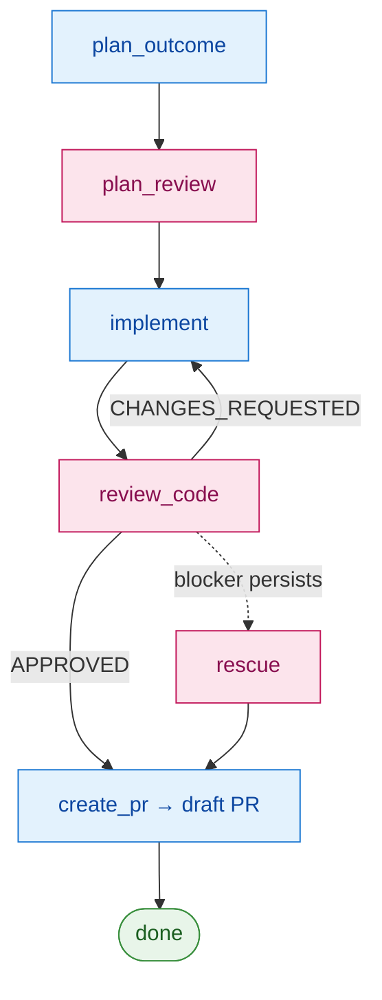

# redteam

[](https://github.com/AscendyProject/redteam/actions/workflows/ci.yml)
[](LICENSE)


An adversarial **agent-pair** harness for shipping code with AI. One model
drives a task through a test-first pipeline (plan → test → implement); a
**different** model reviews the work adversarially; humans gate the
irreversible steps. The collision of two independent model perspectives is the
point — automatic self-agreement is what it exists to prevent.

> Status: early. redteam was built as one project's internal harness and then
> extracted into this standalone repo, which owns it going forward — it has
> driven real, merged pull requests. (Its early git history reflects that origin,
> including cross-repo coordination from the parent project.) APIs and layout may
> still move.

**Quick install (Claude Code) — two commands:**

```text
/plugin marketplace add AscendyProject/redteam
/plugin install redteam@ascendy-redteam
```

Not on Claude Code? Vendor it into any repo — see [Install](#install).

## What it does

Given a batch of tasks (each a short `input.md` brief), the orchestrator walks
every task through a fixed pipeline, persisting `state.json` after each phase so
a run is fully resumable and retrying on `CHANGES_REQUESTED`:



<sub>Blue = **worker** model (writes) · pink = **reviewer** model (adversarial, fresh).</sub>

This is the default **agent-pair** flow. By design it runs with **no human gates
in the common path** — the adversarial pair plus verification *is* the trust, and
the output is a **draft PR** (your existing human checkpoint before merge), not an
auto-merge. Human gates are something you **add back for risky changes**, not the
default tax on every change — see [When to use it](#when-to-use-it). (The
alternative single-model **TDD** mode replaces `plan_review` with a
`write_test → verify_test` pair before `implement`.)

Each phase is run by a focused sub-agent with its own prompt and tool scope
(`.claude/agents/*.md`): an outcome-planner, test-author/verifier, implementer,
code-security-reviewer, and pr-author. The reviewer is a *fresh* agent that only
sees the diff and the project's security checklist — it never sees the
implementer's reasoning.

## How it's different

A plain "two-model" setup stops at *a second model takes a second look*. redteam
makes that separation structural and then acts on it:

- **Findings are tiered, not pass/fail.** The reviewer emits findings with a
  severity (`blocker` / `major` / `minor`), and the orchestrator tracks each one
  *across review rounds* (a carry-over count) — a review is not a single thumbs
  up/down.
- **Persistent problems escalate on a ladder.** A blocker that survives multiple
  rounds climbs: retry the worker → a heavier `rescue` pass → hand to a human
  (`ask_user`). So one rejection doesn't kill a run, and a stubborn real bug
  doesn't get rubber-stamped after a single retry.
- **The reviewer is blind to the writer.** It's a fresh agent — and a
  configurably *different* model — that sees only the diff and the security
  checklist, never the implementer's reasoning, so self-justification can't
  cross the boundary.
- **Humans gate the irreversible steps** (plan approval, PR creation). It never
  autonomously merges.
- **Either model on either side, zero runtime deps.** See
  [Model freedom](#model-freedom) and [Install](#install).

## Model freedom

Roles bind to providers through a small adapter registry, not hardcoded calls.
Today Claude and Codex can each take **either** side:

| role | providers implemented |
|------|-----------------------|
| worker (planner / implementer) | `claude`, `codex` |
| reviewer / rescue | `codex`, `claude` |

You choose per role in `.redteam/config.toml [models]`. A reviewer value that
isn't an adapter (e.g. `"human"`) falls back to the manual flow (you paste the
review and touch the sentinel). Adding another provider is one adapter file plus
one registry line.

## When to use it

The goal is **minimal human intervention, without losing trust** — the
adversarial pair is the automated trust, so the common path has no human gates.
But not every change needs the same weight: a typo shouldn't pay for a full
agent-pair, and an auth change shouldn't ship with only the light path. So you
**scale the response to the risk of the change**:

| change | response |
|---|---|
| trivial — non-behavior-changing (rename, comment, formatting) | single-agent, no review |
| routine — small, local, reversible | single-agent loop; review optional |
| **guarded** — behavior change with real blast radius (auth, storage, concurrency, public API, migrations) | the adversarial pair + verification (the default) |
| **strategic / production-critical** — architectural, irreversible, or changes prod posture | the pair **plus human gates** (and a rollback plan you require) |

**Tier-aware routing** lets the harness apply this automatically (opt-in via
`config.toml`). You define tier profiles as declarative toggles, and a
deterministic classifier picks each task's tier:

```toml
[tiers.0]                       # trivial
review = false                  # single-agent, no adversarial pair
models = { implementer = "claude-haiku-4-5" }   # cheap model

[tiers.2]                       # guarded (a sensible default)
review = true                   # the adversarial pair; no human gate

[tiers.4]                       # production-critical
review = true
gates = ["outcome", "pr"]       # add human checkpoints back here

[tier_triggers]
"**/auth/**" = 4                # touching auth floors the task at tier 4
default = 2                     # unclassified → safe default
```

The binding tier is `max(declared, path-triggered, default)` — a task can be
**raised** but never lowered below what its paths demand, and an unclassified task
falls to the mandatory safe default. With no `[tiers]` section, routing is off and
every task takes the default pipeline (fully backward-compatible).

Two levers also work on their own, without tiers:

- **Model per role** (`[models]`) — a cheaper implementer for routine work, a
  frontier reviewer for guarded work; either provider on either side.
- **The escalation ladder** — a `blocker` finding that survives review rounds
  climbs retry → `rescue`, concentrating effort where a problem actually persists.

Trigger globs are git-pathspec-style: `*` matches within a path segment, `**`
matches across directories (so `**/auth/**` matches `auth/x` at any depth).

> Scope note: v1 path triggers match the paths a task *declares* in its
> front-matter, and tier profiles vary review/gates/models over the canonical
> pipeline (not arbitrary phase orders). Re-checking the real committed diff and
> richer profiles are tracked on
> [issue #13](https://github.com/AscendyProject/redteam/issues/13).

## Install

### As a Claude Code plugin (recommended)

This repo doubles as a single-plugin marketplace, so two commands install it:

```text
/plugin marketplace add AscendyProject/redteam
/plugin install redteam@ascendy-redteam
```

That registers the six sub-agents and a `/redteam:redteam-install` command. Run
that command (or the `redteam-install` tool it puts on PATH) from your project
root to vendor the harness in:

```text
/redteam:redteam-install        # vendors .redteam/ into the current repo
```

### Or vendor directly (any stack, no Claude Code needed)

```bash
# from a clone of this repo:
python3 .redteam/scripts/install.py /path/to/your/project

# preview first:
python3 .redteam/scripts/install.py /path/to/your/project --dry-run
```

Either way it's the same vendoring model: the harness ships *inside* your project
tree (`.redteam/`) because the engine resolves your repo root from its own file
location. Harness-owned files (`workflows/`, `prompts/`, `templates/`, agent
skeletons) are re-vendored on each run (`--overwrite` to refresh); project-owned
files (`config.toml`, `docs/*`, `verify.sh`, your `batches/`) are seeded once and
never overwritten.

The installer does **not** vendor the harness's own unit tests, so a consumer
never runs (or maintains) them — your `verify.sh` runs *your* tests, not the
engine's. The vendored `.redteam/` engine follows the harness's own style, so
**exclude `.redteam/` from your project's linter/formatter** (e.g. ruff's
`extend-exclude`, an eslint ignore) to avoid it flagging code you don't own.

### Requirements

- Python 3.11+ (stdlib only — zero runtime pip dependencies).
- The model CLIs you configure, installed and authenticated:
  [`claude`](https://claude.com/claude-code) and/or `codex`.

## Configure

Edit `.redteam/config.toml` for your stack (paths, `verify_command`,
`branch_prefix`, role→model), then fill the three project docs the sub-agents
read:

- `.redteam/docs/project-context.md` — stack + hard rules
- `.redteam/docs/security-checklist.md` — the reviewer's hard lines
- `.redteam/docs/test-conventions.md` — how your test suite is wired

Two complete examples to copy the shape from: `examples/fastapi-like/` (Python —
FastAPI + Celery + Postgres + a vector DB) and `examples/nuxt-like/` (JS/TS — Nuxt 3 +
Vue + Vitest).

## Run

```bash
python3 .redteam/workflows/orchestrator.py start  .redteam/batches/<batch>
python3 .redteam/workflows/orchestrator.py resume .redteam/batches/<batch>
python3 .redteam/workflows/orchestrator.py status .redteam/batches/<batch>
```

A batch is a directory of `tasks/<task-id>/input.md` briefs. The orchestrator
creates a per-task branch (`<branch_prefix>/<task-id>`), runs the pipeline, and
stops at each human gate until you touch the sentinel file it names.

## Contributing

Issues and PRs welcome. See [CONTRIBUTING.md](.github/CONTRIBUTING.md) for the
dev setup and the gate (`bash .redteam/scripts/verify.sh`), and the
[Code of Conduct](.github/CODE_OF_CONDUCT.md). The engine stays
project-agnostic and stdlib-only — those two invariants drive most review
feedback. To report a vulnerability, see [SECURITY.md](.github/SECURITY.md)
(don't open a public issue).

## License

Apache License 2.0 (`LICENSE`). Contributions are accepted under the
[Contributor License Agreement](CLA.md), which keeps provenance clean and
preserves the option of offering the project under other terms.
