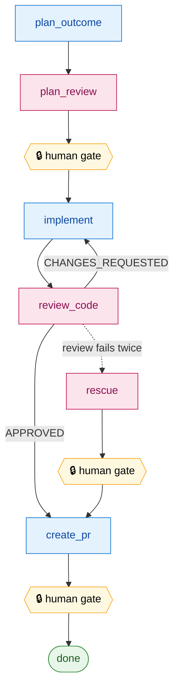

# redteam

[](https://github.com/AscendyProject/redteam/actions/workflows/ci.yml)
[](LICENSE)


An adversarial **agent-pair** harness for shipping code with AI. One model
drives a task through a test-first pipeline (plan → test → implement); a
**different** model reviews the work adversarially; humans gate the
irreversible steps. The collision of two independent model perspectives is the
point — automatic self-agreement is what it exists to prevent.

> Status: early. Extracted from a private monorepo where it has driven real,
> merged pull requests. APIs and layout may still move.

## What it does

Given a batch of tasks (each a short `input.md` brief), the orchestrator walks
every task through a fixed pipeline, persisting `state.json` after each phase so
a run is fully resumable, retrying on `CHANGES_REQUESTED`, and **blocking at
human gates** (sentinel files you touch to approve):



<sub>Blue = **worker** model (writes) · pink = **reviewer** model (adversarial, fresh) · yellow = **human gate**.</sub>

That is the default **agent-pair** flow (a separate reviewer model reviews the
implementer). The alternative single-model **TDD** mode (`mode = "tdd"` in a
task's `state.json`) replaces `plan_review` with a `write_test → verify_test`
pair before `implement`; the gates and the `review_code → … → create_pr` tail
are the same.

Each phase is run by a focused sub-agent with its own prompt and tool scope
(`.claude/agents/*.md`): an outcome-planner, test-author/verifier, implementer,
code-security-reviewer, and pr-author. The reviewer is a *fresh* agent that only
sees the diff and the project's security checklist — it never sees the
implementer's reasoning.

## Model freedom

Roles bind to providers through a small adapter registry, not hardcoded calls.
Today Claude and Codex can each take **either** side:

| role | providers implemented |
|------|-----------------------|
| worker (planner / implementer) | `claude`, `codex` |
| reviewer / rescue | `codex`, `claude` |

You choose per role in `.redteam/config.toml [models]`. A reviewer value that
isn't an adapter (e.g. `"human"`) falls back to the manual flow (you paste the
review and touch the sentinel). Adding another provider is one adapter file plus
one registry line.

## Install (vendoring)

The harness ships *inside* your project tree (`.redteam/`), because the engine
resolves your repo root from its own file location. Install copies the engine in
and seeds the files you fill out:

```bash
# from a clone of this repo:
python3 .redteam/scripts/install.py /path/to/your/project

# preview first:
python3 .redteam/scripts/install.py /path/to/your/project --dry-run
```

Harness-owned files (`workflows/`, `prompts/`, `templates/`, agent skeletons)
are re-vendored on each run (`--overwrite` to refresh). Project-owned files
(`config.toml`, `docs/*`, `verify.sh`, your `batches/`) are seeded once and
never overwritten.

### …or install as a Claude Code plugin

This repo doubles as a single-plugin marketplace, so you can skip the manual
clone. Add it and install once:

```text
/plugin marketplace add AscendyProject/redteam
/plugin install redteam@ascendy-redteam
```

That registers the six sub-agents and a `/redteam:redteam-install` command. Run
the command (or the `redteam-install` tool it puts on PATH) from your project
root to vendor the harness in — it just wraps the same installer, so the
vendored-copy model above is unchanged:

```text
/redteam:redteam-install        # vendors .redteam/ into the current repo
```

### Requirements

- Python 3.11+ (stdlib only — zero runtime pip dependencies).
- The model CLIs you configure, installed and authenticated:
  [`claude`](https://claude.com/claude-code) and/or `codex`.

## Configure

Edit `.redteam/config.toml` for your stack (paths, `verify_command`,
`branch_prefix`, role→model), then fill the three project docs the sub-agents
read:

- `.redteam/docs/project-context.md` — stack + hard rules
- `.redteam/docs/security-checklist.md` — the reviewer's hard lines
- `.redteam/docs/test-conventions.md` — how your test suite is wired

Two complete examples to copy the shape from: `examples/ascendy-like/` (Python —
FastAPI + Celery + Postgres + Milvus) and `examples/nuxt-like/` (JS/TS — Nuxt 3 +
Vue + Vitest).

## Run

```bash
python3 .redteam/workflows/orchestrator.py start  .redteam/batches/<batch>
python3 .redteam/workflows/orchestrator.py resume .redteam/batches/<batch>
python3 .redteam/workflows/orchestrator.py status .redteam/batches/<batch>
```

A batch is a directory of `tasks/<task-id>/input.md` briefs. The orchestrator
creates a per-task branch (`<branch_prefix>/<task-id>`), runs the pipeline, and
stops at each human gate until you touch the sentinel file it names.

## Contributing

Issues and PRs welcome. See [CONTRIBUTING.md](.github/CONTRIBUTING.md) for the
dev setup and the gate (`bash .redteam/scripts/verify.sh`), and the
[Code of Conduct](.github/CODE_OF_CONDUCT.md). The engine stays
project-agnostic and stdlib-only — those two invariants drive most review
feedback. To report a vulnerability, see [SECURITY.md](.github/SECURITY.md)
(don't open a public issue).

## License

GNU AGPLv3 (`LICENSE`). Contributions are accepted under the
[Contributor License Agreement](CLA.md), which preserves the option of an
alternative/commercial license.
